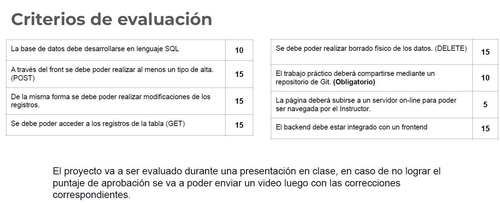

# Desafio Frontend (Equipo 8)

1.- El sitio web debe poseer al menos 4 páginas HTML o 4 secciones si se trata de un sitio One Page.

El sitio web desarrollado cuenta con las siguientes páginas:
- index.html
- destinos.html
- ofertas.html
- contacto.html
- info-nosotros.html
- info1.html
- info2.html
- info3.html
- info4.html

2.- El sitio web debe incluir un formulario de contacto, con al menos 5
campos que incluya (un checkbox o radiobutton), un select y una
imagen, con validación realizada mediante JavaScript para que los
campos sean obligatorios.

3.- Tener al menos una página totalmente responsive con mínimo 3
puntos de corte con media querys para 3 tamaños de dispositivos
(PC escritorio, Tablet, Celular). Para el diseño debe usarse CSS.

El sitio web desarrollado cuenta con diseño responsivo para cualquier dispositivo.

De igual forma se incluyó el menú hamburguesa para estilizar mejor el sitio.

4.- Utilizar al menos una animación, transformación o una transición.

- Animación de carrusel en la página principal,
- Animación de imagenes en ofertas.
- Animación de imagenes en Destinos.
 

5.- Poseer una estructura HTML maquetada con Flexbox y/o Grid.

Contamos con varias secciones del sitio web configurado con Flex y Grid

.inicio-section {
  background-image: url(images/hero_image.png);
  height: 100vh;
  display: grid;
  color: white;
  place-items: center;
  text-align: center;
}

.inicio-section .container {
  display: flex;
  flex-direction: column;
  gap: 30px;
}

nav {
  display: flex;
  justify-content: space-between;
  align-items: center;
  color: white;
  padding: 20px 0;
}

6.- Se considerará la presentación general del proyecto, la
legibilidad del mismo, la navegación sin llegar a puntos de no
retorno, la optimización de imagenes para la web y el uso de
favicon

- Colores acordes a imagenes para una comprensión de lectura
- Link seteados correctamente
- Imagenes optimizadas en formato PNG.
- Uso de imagen de Favicon en todas las páginas.
 
 
7.- El trabajo práctico deberá subirse a un servidor online y
compartirse mediante un repositorio de Git.

El sitio web se encuentra alojado en Github de manera pública, se puede 
acceder al repositorio en el siguiente link : https://github.com/Grupo8CursoPython/FullViajes

8.- La página deberá subirse a un servidor on-line para poder
ser navegada por el Docente. Ejemplo: Netlify o similar.
(Mandatorio)

El sitio web se encuentra publicado en Github Page y se puede observar a través
del siguiente enlace: https://grupo8cursopython.github.io/FullViajes/

9.- El sitio web debe estar estructurado utilizando etiquetas
semánticas HTML correctamente. Debe pasar la validación
de https://validator.w3.org/ sin errores. (Mandatorio).

Se sometío el sitio web al validador y estos fueron los resultados:

10.- Utilizar iframes y/o íconos de FontAwesome y/o fuentes
locales o bien de Google Fonts.Es optativo incluir algún
elemento de Bootstrap.

- Se utilizó iframe en la página index.html para mostrar una pantalla de Google Map
- También se utilizaron fuentes externas de Google Font.

@import url("https://fonts.googleapis.com/css2?family=Roboto:ital,wght@0,100;0,300;0,500;0,700;0,900;1,100;1,300;1,400;1,500;1,700;1,900&display=swap");

### Equipo 8:
- Rosmar Palma
- Mark Barrios
- Antonella Catania
- William Izquierdo