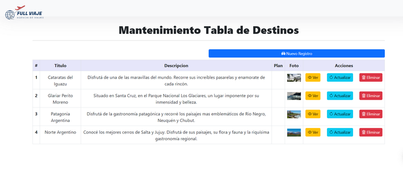

# Desafio Backend (Equipo 8)

1.- La BBDD debe desarrollarse en lenguaje SQL.

BBDD desarrollada el lenguaje SQL y Tabla Destinos creada con script SQL.

2.- A través del Front se debe poder realizar al menos un tipo de alta (POST).

Se puede incluir nuevos registros a traves de peticiones POST desde el Front.

3.- De la misma forma se debe poder realizar modificaciones a los registros.

También Se puede modificar registros a traves de peticiones POST desde el Front.

4.- Se debe poder acceder a los registros de la tabla (GET).

5.- Se debe poder realizar borrado físico de los registros (DELETE).

En el cuadro de acciones podemos elimiar fisicamente los registros de la tabla.

6.- El trabajo práctico deberá subirse a un servidor online y compartirse mediante un repositorio de GIT.

El sitio web se encuentra alojado en Github de manera pública, se puede 
acceder al repositorio en el siguiente link : https://github.com/Grupo8CursoPython/FullViajesBack

7.- La página deberá subirse a un servidor on-line para poder
ser navegada por el instructor.

El sitio web se encuentra publicado en Servidor de PythonAnywhere y se puede acceder mediante el siguiente link: https://grupo8cursopython.pythonanywhere.com/

8.- El Backend debe estar integrado con un Frontend:

Anexamos código de la conexión a la BBDD externa:

### Equipo 8:
- Rosmar Palma
- Mark Barrios
- Antonella Catania
- William Izquierdo